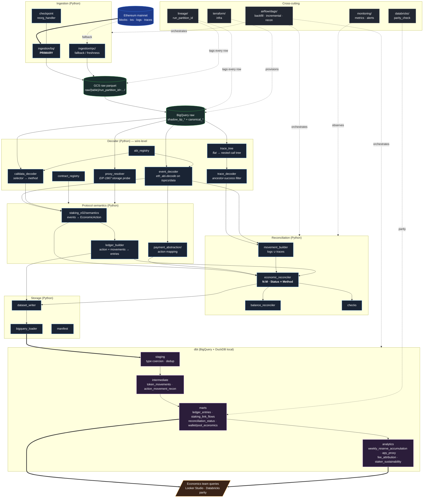
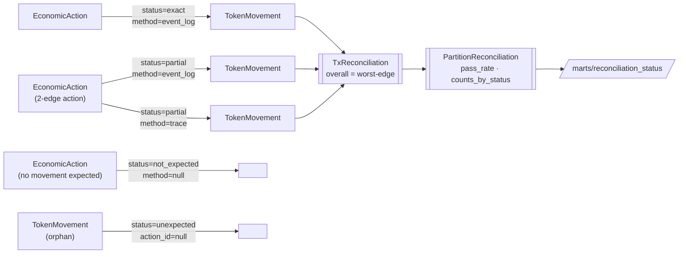

# Chainlink Economic Ledger

> Reconstructs LINK token movements for Staking v0.2 and Payment Abstraction from raw Ethereum artifacts. ABI-driven decoding in Python, internal-trace walking, EIP-1967 proxy probing, N:M reconciliation, and a double-entry economic ledger exposed through dbt.


Two real mainnet transactions are reconciled end-to-end as part of the test suite:

| Fixture | Tx | Block | Net LINK |
|---|---|---|---|
| Staking v0.2 stake | [`0x08c2902756cb…`](https://etherscan.io/tx/0x08c2902756cb28085da691e3712c83c83c92d9f49b6e22c0e2bf5e9b9e4a9d22) | 18,671,459 | 146.00 |
| PA Reserves deposit | [`0x92359883d1f3…`](https://etherscan.io/tx/0x92359883d1f38f36c619247ac9e0e6049cb5fcc7282012fc78ecf4089434ed91) | 24,139,066 | 9,463.18 |

> The repository was AI-assisted and curated into a portfolio project. The AI process notes are preserved under [`docs/ai-assisted-development/`](docs/ai-assisted-development/) for transparency. A richer, styled architecture page is at [`docs/architecture.html`](docs/architecture.html).

---

## Production pipeline



---

## The four moves past "Dune analyst"

The recruiter note's literal phrase was *"beyond basic RPC-based blockchain querying"*. Each move below is a concrete capability the pipeline demonstrates.

| Move | What | Why it matters |
|---|---|---|
| **1. Decoder** | Hand-decoded raw EVM bytes — `eth_abi.decode` on `topics[1:]` + `data`, no `web3.py` contract wrappers, no deployed-contract instance needed | Historical events decoded directly from wire format |
| **2. Trace walking** | BigQuery flat `trace_address` rows reconstructed into a nested call tree; movement emitted only when `call.success ∧ every_ancestor.success ∧ tx.status==1` | The ancestor-success filter is the kind of nuance that separates "I've used eth_getLogs" from "I've reverse-engineered txs" |
| **3. Proxy probing** | Probed the three PA contracts via `eth_getStorageAt` on EIP-1967 impl/admin/beacon slots; all returned `0x000…0` — they are **not** proxies | Verified negative, disclosed honestly. Saved building a resolver for contracts that didn't need one |
| **4. Reconciliation** | `match_action_to_movements` returns `list[Match]`, never `Transfer \| None`. Status × Method per edge | An action maps to 0, 1, or many movements. Ambiguity is surfaced, not silenced |

---

## Reconciliation model



`Status ∈ {exact, partial, unmatched, not_expected, unexpected, ambiguous}`
`Method ∈ {event_log, trace, balance_inferred, manual_rule}` (nullable when `status=not_expected`)

---

## Seven deterministic ID grains

Every entity has a pure `sha256(canonical_key)` ID. Replays produce identical IDs and identical row hashes. No UUIDs, no `time.time()`, no Python `hash()` (PYTHONHASHSEED).

| Grain | ID function | Canonical key |
|---|---|---|
| Raw log | `compute_raw_log_id` | `chain_id · block_number · tx_hash · log_index` |
| Decoded event | `compute_decoded_event_id` | same range, tagged `decoded` |
| Raw trace call | `compute_raw_trace_call_id` | `tx_hash · trace_address` |
| Token movement | `compute_movement_id` | `chain_id · tx_hash · from · to · amount · occurrence_index` |
| Economic action | `compute_action_id` | `decoded_event_id · kind` |
| Ledger entry | `compute_ledger_entry_id` | `action_id · entry_index` |
| Run partition | `compute_run_partition_id` | `chain_id · dag_id · run_id · source · partition_key` |

---

## Local quickstart

```bash
uv sync --all-extras
cp .env.example .env
cp dbt/profiles.yml.example dbt/profiles.yml

uv run pytest tests/unit -v       # 293 passed, no live RPC/BQ required
make dbt-build-local              # decode fixtures · seed DuckDB · build marts · run 73 tests
```

`make dbt-build-local` produces the verifiable end-to-end output in ~90 seconds against a local DuckDB target. No cloud credentials required.

---

## Module map

| Area | Path |
|---|---|
| BigQuery extractors | `ingestion/bq/` |
| RPC fallback utilities | `ingestion/rpc/` |
| ABI / event / calldata / trace decoding | `decoder/` |
| Staking semantics and ledger builder | `protocols/staking_v02/` |
| Payment Abstraction semantics | `protocols/payment_abstraction/` |
| Reconciliation logic | `reconciliation/` |
| Storage and BigQuery loading adapters | `storage/` |
| dbt models and tests | `dbt/` |
| Local fixture-to-seed runner | `scripts/seed_to_local.py` |
| Airflow DAGs and EVM operators | `airflow/` |
| Databricks parity notebook | `databricks/` |
| Terraform infra | `terraform/` |

---

## What runs vs what's scaffolded

The local decode → reconciliation → dbt path runs end-to-end against real mainnet fixtures. The production runtime adapters are present to show the operating model; not every adapter is wired to a live scheduler or cloud project.

| Subsystem | Status |
|---|---|
| Fixture decoding and reconciliation | ✅ Runs |
| Staking and PA semantic mapping for covered fixtures | ✅ Runs |
| dbt local DuckDB build and tests | ✅ Runs (29 models, 73 tests) |
| Python unit tests | ✅ 293 passed |
| BigQuery public dataset extractors | 🟡 Callable; live writes require GCP setup |
| GCS / DuckDB dataset writers | 🟡 Callable; local fallback used by the demo |
| Airflow DAG skeleton | 🟡 Imports cleanly; production task bodies not wired |
| Backfill / incremental / reconciliation DAGs | 🟠 Scaffolded |
| Custom Airflow EVM operators | 🟠 Scaffolded |
| Databricks GCS → Delta materialization | 🟠 Scaffolded |
| Monitoring and source-manifest sinks | 🟠 Scaffolded |

---

## Output marts

Marts are named for the economic question they answer, not for table mechanics. Every mart has a dbt contract, freshness check, and `run_partition_id` lineage tag.

| Mart | Question it answers |
|---|---|
| `marts.ledger_entries` | Every LINK movement booked double-entry; `Σ debit == Σ credit` enforced as a dbt invariant |
| `marts.staking_link_flows` | One row per stake / unstake / reward event with reconciliation status |
| `marts.reconciliation_status` | Per-partition pass rate and counts by status |
| `marts.wallet_economics` | Per-wallet aggregate LINK in / out / net by protocol surface |
| `marts.pool_economics` | Per-pool inflow, outflow, principal delta, reward outflow |
| `analytics.weekly_reserve_accumulation` | PA Reserve LINK growth per week, split by inflow source |
| `analytics.apy_realized_by_pool` | Daily reward-yield proxy (disclosed as proxy, not true TWAP-APY) |
| `analytics.fee_attribution_by_source` | PA fee inflow by Chainlink service: VRF / Functions / Data Streams / CCIP |
| `analytics.staker_reward_sustainability` | Reward outflow vs Reserve inflow per snapshot |

---

## Known limitations

- Several production adapters raise `NotImplementedError`; the local demo does not exercise them.
- A few contract addresses, event signatures, and deploy blocks remain `TBD` until verified from on-chain or Etherscan source-of-truth.
- The analytics APY view is a reward-yield proxy, not a time-weighted realized APY series. See the comment at the top of `dbt/models/analytics/apy_realized_by_pool.sql`.
- Integration tests are skipped without live RPC, BigQuery, GCS, and Airflow infrastructure.
- The demo proves pipeline shape on two real fixtures; broader protocol coverage would require more reference transactions.

## Useful commands

```bash
make test-unit          # Python unit tests
make dbt-build-local    # local end-to-end DuckDB demo
make test-integration   # live-runtime checks; skipped locally
make lint               # ruff + mypy
```

## Documentation

- [`docs/architecture.html`](docs/architecture.html) — full architecture page (open in a browser)
- [`docs/architecture.md`](docs/architecture.md) — system layout and data flow
- [`docs/data-model.md`](docs/data-model.md) — marts and reconciliation status semantics
- [`docs/protocol-validation.md`](docs/protocol-validation.md) — fixture and on-chain validation notes
- [`docs/reproduction.md`](docs/reproduction.md) — local and live reproduction paths
- [`docs/runbook.md`](docs/runbook.md) — operational notes
- [`docs/limitations.md`](docs/limitations.md) — known gaps and next steps

## License

MIT
