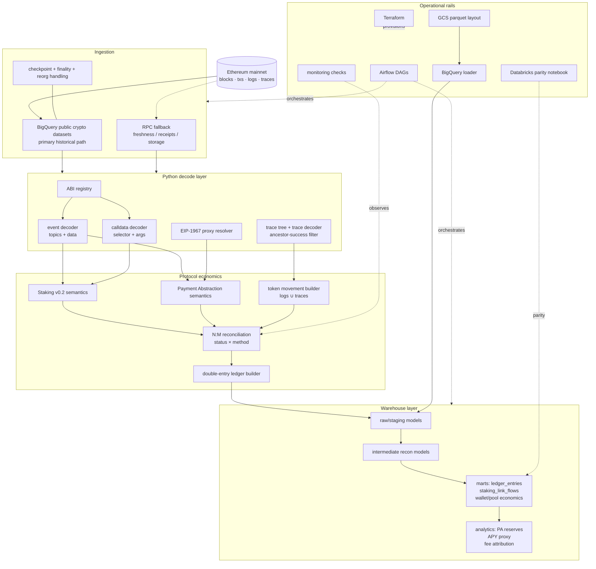

# Chainlink Economic Ledger

> A reproducible data engineering project that reconstructs Chainlink LINK economics from raw Ethereum artifacts: event logs, calldata, traces, contract ABIs, and deterministic replay IDs.

[](#verification)
[](#verification)
[](#quickstart)
[](LICENSE)

**Live architecture page:** https://neeshant-pandey.github.io/chainlink-economic-ledger/architecture.html

---

## Overview

Chainlink economics data is not just a list of token transfers. Useful analysis requires reconstructing protocol actions from raw EVM artifacts, matching those actions to observable LINK movement, and publishing stable marts that can survive replay, reorgs, and contract changes.

This project turns raw on-chain history into durable economic tables using:

- ABI-driven decoding from raw EVM log topics/data.
- Internal trace walking with reverted-call filtering.
- EIP-1967 proxy slot probing.
- N:M action-to-movement reconciliation.
- Double-entry LINK ledger entries with dbt invariants.
- Replay-safe deterministic IDs across Python and dbt layers.

The result is a reproducible Chainlink economics pipeline: **raw Ethereum artifacts → decoded protocol facts → reconciled LINK movements → marts for economics analysis.**

---

## Proven local outputs

Two real Ethereum mainnet transactions are decoded and reconciled end-to-end in the local execution path.

| Protocol surface | Real tx | Block | Economic movement |
|---|---:|---:|---:|
| Staking v0.2 stake | [`0x08c2902756cb…`](https://etherscan.io/tx/0x08c2902756cb2808c056499225d6dbd40c3e656a3b53fe9d31679fcb8dc15e96) | 18,671,459 | 146.00 LINK |
| Payment Abstraction Reserves deposit | [`0x92359883d1f3…`](https://etherscan.io/tx/0x92359883d1f38f36c619247ac9e0e6049cb5fcc7282012fc78ecf4089434ed91) | 24,139,066 | 9,463.18 LINK |

Local verification currently covers:

| Check | Result |
|---|---:|
| Python unit tests | 293 passed |
| dbt models built locally | 29 |
| dbt data tests | 73 passed |
| Fixture-to-DuckDB end-to-end build | passes |
| No-cloud reproduction script | passes |

---

## Quickstart

```bash
uv sync --all-extras
./scripts/repro.sh --fixture-only
make dbt-build-local
```

No cloud credentials are required for this path. It uses cached real mainnet artifacts, decodes them, seeds DuckDB, builds marts, and runs dbt tests.

Expected headline output:

```text
293 passed
Done. PASS=73 WARN=0 ERROR=0 SKIP=0 NO-OP=0 TOTAL=73
main_marts.ledger_entries                 6 rows
main_marts.reconciliation_status          1 rows
main_analytics.weekly_reserve_accumulation 1 rows
```

---

## Core technical capabilities

| Capability | What the project does | Why it matters |
|---|---|---|
| **Wire-level decoding** | `eth_abi.decode` on event `topics[1:]` and `data`; calldata selector decoding; no contract wrapper dependency | Historical logs can be decoded directly from warehouse/RPC artifacts |
| **Trace reconstruction** | Flat BigQuery-style trace rows become a nested call tree; movements only count when the call, ancestors, and tx succeeded | Avoids counting reverted internal transfers as economic truth |
| **Proxy probing** | EIP-1967 implementation/admin/beacon slots are checked via storage words | Handles upgradeable-contract reality instead of assuming ABI/address stability |
| **Economic reconciliation** | `EconomicAction` maps to 0, 1, or many `TokenMovement` edges with explicit `status × method` | Ambiguity is surfaced for operators instead of hidden behind a nullable transfer |

---

## Architecture



The styled version is easier to read: [`docs/architecture.html`](docs/architecture.html).

---

## Data model highlights

### Double-entry ledger

Every booked LINK movement is represented as balanced debit/credit rows.

```text
wallet:0xedacecf...                 debit      146.00 LINK
community_staking_pool:0xbc10...    credit     146.00 LINK

pa_swap_automator:0x36e8...         debit    9,463.18 LINK
forwarded_to:0xd6e3...              credit   9,463.18 LINK
upstream:0x36e8...                  debit    9,463.18 LINK
pa_reserves:0x5680...               credit   9,463.18 LINK
```

Invariant: for every tx, `SUM(debits) == SUM(credits)`. This is enforced in Python and again in dbt via `assert_ledger_balanced_per_tx.sql`.

### Reconciliation edge model

```text
EconomicAction ──┐
                 ├── ActionMovementMatch(status, method, allocated_amount)
TokenMovement ───┘
```

Statuses are explicit: `exact`, `partial`, `unmatched`, `not_expected`, `unexpected`, `ambiguous`.
Methods are explicit: `event_log`, `trace`, `balance_inferred`, `manual_rule`.

---

## Deterministic replay design

Every durable entity uses `sha256(canonical_key)` IDs. Replays produce the same IDs and row hashes; `run_partition_id` is lineage metadata, not part of mart keys.

| Grain | Function | Canonical key |
|---|---|---|
| Raw log | `compute_raw_log_id` | `chain_id · block_number · tx_hash · log_index` |
| Decoded event | `compute_decoded_event_id` | raw log key + decoded tag |
| Raw trace call | `compute_raw_trace_call_id` | `tx_hash · trace_address` |
| Token movement | `compute_movement_id` | `chain_id · tx_hash · from · to · amount · occurrence_index` |
| Economic action | `compute_action_id` | `decoded_event_id · action_kind` |
| Ledger entry | `compute_ledger_entry_id` | `action_id · entry_index` |
| Run partition | `compute_run_partition_id` | `chain_id · dag_id · run_id · source · partition_key` |

---

## Repository map

| Area | Path | Purpose |
|---|---|---|
| BigQuery extractors | [`ingestion/bq/`](ingestion/bq/) | Historical blocks/logs/traces/tx extraction shape |
| RPC utilities | [`ingestion/rpc/`](ingestion/rpc/) | Fallback receipts, storage probes, freshness checks |
| EVM decoding | [`decoder/`](decoder/) | ABI registry, event/calldata/trace/proxy decoding |
| Protocol semantics | [`protocols/`](protocols/) | Staking v0.2 and Payment Abstraction action mapping |
| Reconciliation | [`reconciliation/`](reconciliation/) | Movements, action matching, balance checks |
| dbt | [`dbt/`](dbt/) | Raw/staging/intermediate/marts/analytics SQL + tests |
| Local fixture runner | [`scripts/seed_to_local.py`](scripts/seed_to_local.py) | Converts real mainnet fixtures into dbt seeds |
| Orchestration | [`airflow/`](airflow/) | Production DAG shape |
| Cross-warehouse parity | [`databricks/`](databricks/) | Delta vs warehouse row/hash parity check |
| Infrastructure | [`terraform/`](terraform/) | GCS, BigQuery, and service-account resource definitions |
| Docs | [`docs/`](docs/) | Architecture, data model, reproduction, and operations |

---

## Production data engineering signals

| Capability | Where it shows up |
|---|---|
| Historical warehouse-first extraction | `ingestion/bq/` models Ethereum blocks, logs, traces, and transactions as warehouse inputs |
| RPC fallback and storage probes | `ingestion/rpc/` supports receipts, freshness checks, and EIP-1967 slot reads |
| Deterministic replay | Stable entity IDs plus `run_partition_id` lineage keep replays idempotent |
| Reorg/finality awareness | `ingestion/finality.py`, `ingestion/reorg_handler.py`, and canonical/shadow dbt models |
| Data quality gates | 73 dbt tests, double-entry balance checks, unknown-signature thresholds |
| Orchestration shape | Airflow DAGs for backfill, incremental processing, and reconciliation checks |
| Warehouse portability | Local DuckDB execution plus BigQuery-oriented dbt profiles and SQL macros |
| Cross-warehouse parity | Databricks notebook checks row-count and hash parity for marts |
| Infrastructure-as-code | Terraform modules for GCS, BigQuery, and service accounts |

---

## Output marts

| Mart | Economic question |
|---|---|
| `marts.ledger_entries` | What LINK value moved, booked as a balanced economic ledger? |
| `marts.staking_link_flows` | Which wallets staked/unstaked/claimed and with what reconciliation status? |
| `marts.reconciliation_status` | Are protocol actions matched to observable LINK movements? |
| `marts.wallet_economics` | What is each wallet’s net LINK position by protocol surface? |
| `marts.pool_economics` | How did staking pools accumulate or release LINK? |
| `analytics.weekly_reserve_accumulation` | How much LINK is PA Reserves accumulating weekly? |
| `analytics.apy_realized_by_pool` | What is the reward-yield proxy by pool? |
| `analytics.fee_attribution_by_source` | Which service bucket appears to contribute PA fees? |
| `analytics.staker_reward_sustainability` | How do staking rewards compare with reserve inflows? |

---

## Verification

No-cloud verification commands:

```bash
uv run pytest tests/unit -q
make dbt-build-local
./scripts/repro.sh --fixture-only
```

Recent local result:

```text
293 passed
8 seeds loaded
29 dbt models built
73 dbt data tests passed
fixture-only repro PASSED
```

---

## Documentation

- [`docs/architecture.md`](docs/architecture.md) — architecture and data-flow decisions.
- [`docs/data-model.md`](docs/data-model.md) — mart contracts and reconciliation semantics.
- [`docs/reproduction.md`](docs/reproduction.md) — local and cloud-oriented reproduction paths.

---

## License

MIT
